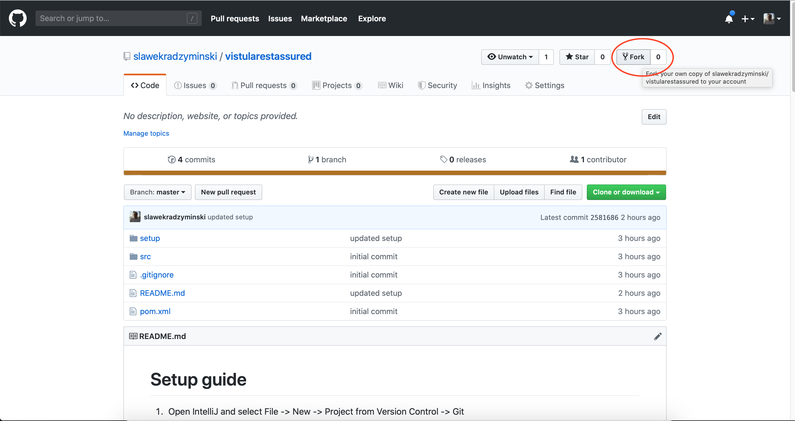
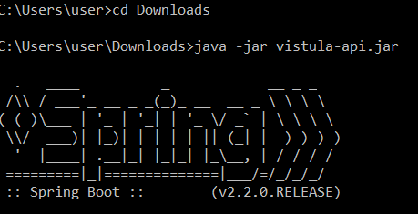
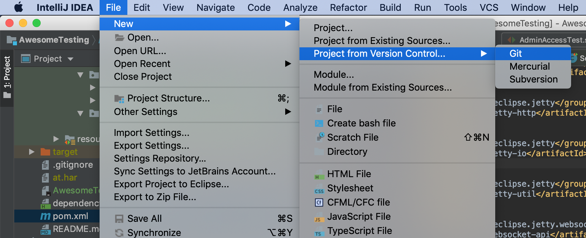
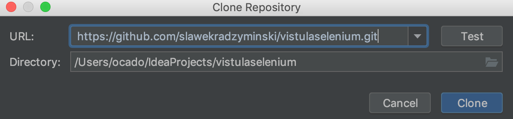
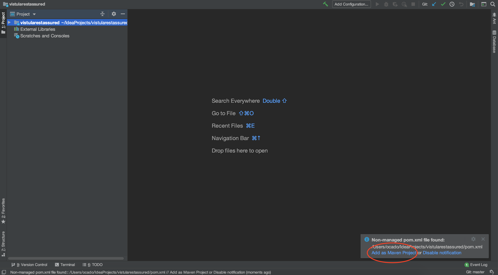
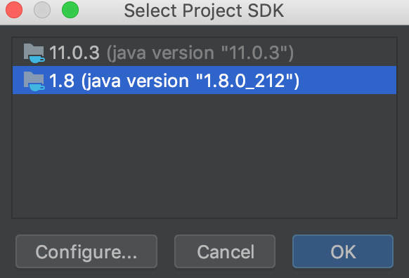

# Fork guide

1. Click Fork in top right corner

2. Do next steps on your fork. You can verify that URL contains your account name instead of `slawekradzyminski`

# API running guide

1. Download API jar from https://drive.google.com/file/d/1lPMnqKBpvHAD_qLYI2YN-cL6M9MqejPY/view

2. Run Jar from command line (open terminal via 'cmd' command in Windows)

`java -jar vistula-api.jar`

3. After around one minute verify that you can access Swagger

http://127.0.0.1:9999/swagger-ui.html

4. Application can be stopped by closing terminal or pressing CTRL + C

# Project setup guide

1. Open IntelliJ and select File -> New -> Project from Version Control -> Git

2. Copy paste your project url to tab. **You should see your account name instead of 'slawekradzyminski'.**

3. After project has loaded open green notification in bottom-right corner. Click on Add as Maven Project

4. Open ArenaTest class and click Setup SDK i top-right corner.

5. Pick Java 8

6. Go to InformationControllerTest class and run test. It should work.

# More

[API source code](https://github.com/slawekradzyminski/vistulasampleapi)